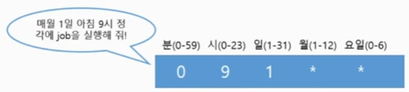

### Cronjob

job 컨트롤러로 실행할 Application Pod를 주기적으로 반복해서 실행
Linux의 cronjob의 스케줄링 기능을 Job Controller에 추가한 API
다음과 같은 반복해서 실행하는 Job을 운영해야 할 때 사용
- Data Backup
- Send email
- CIeaning tasks

### Cronjob Schedule: ' 0 3 1 * * '
매월 1일 3시 정각 실행

- Minutes (from 0 to 59)
- Hours (from 0 to 23)
- Day of the month (from 1 to 31)
- Month (from 1 t0 12)
- Day of the week (from 0 to 6)
  

분(0-59) 시(0-23) 일(1-31) 월(1-12) 요일(0-6)

- (*/5)  : 5분마다
- 1-5    : 1부터 5가지
- 1,5    : 1이나 5
